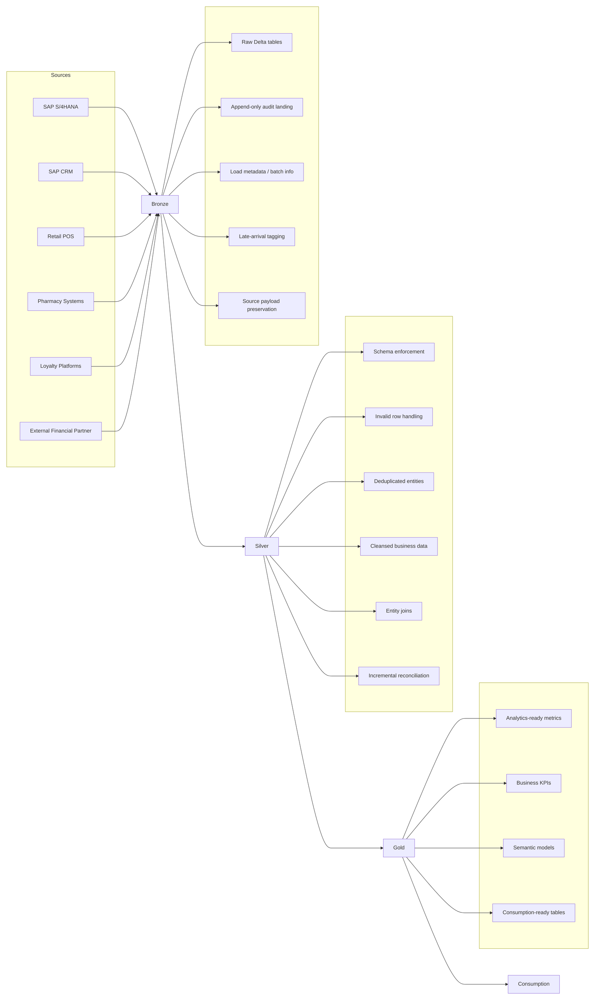

# Lakehouse & Medallion Architecture

## Overview

Target data architecture explaining the Sources → Ingestion → Bronze → Silver → Gold → Consumption and what business logic belongs in each layer

## Architecture diagram

## Diagram explanation

- **Sources**: multiple operational systems feed raw data directly into Bronze, which includes ingestion and landing responsibilities.
- **Bronze**: ingests and stores raw Delta tables in append-only form, preserves audit records, and tags late arrivals.
- **Silver**: applies schema enforcement, invalid-row handling, deduplication, and business cleansing.
- **Gold**: generates analytics-ready metrics, KPIs, and semantic tables for consumption.
- **Consumption**: supports BI, SQL analytics, ML feature pipelines, and data APIs using trusted Gold datasets.

## Sources

Sources include:

- SAP S/4HANA
- SAP CRM
- Retail POS transactions
- Pharmacy systems
- Loyalty platforms
- External financial-services partner

Each source should deliver data directly into Bronze through a controlled landing mechanism such as file landing, streaming event bus, or partner API. The full Bronze landing and ingestion workflow can be implemented using Spark Structured Streaming (SDS) and Delta Autoloader, which enables schema inference, incremental file discovery, and append-only writes into Delta.